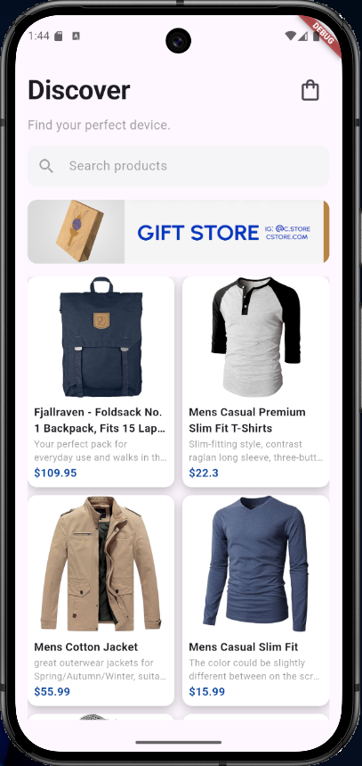
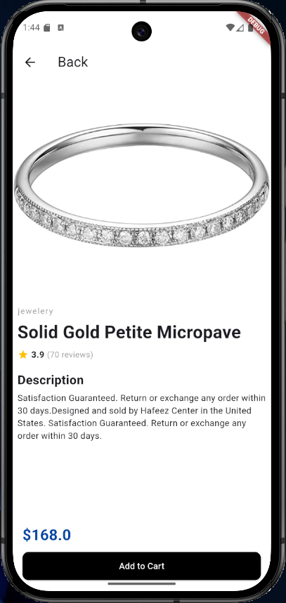
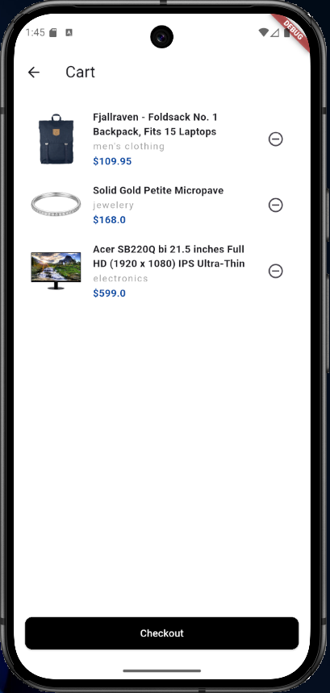
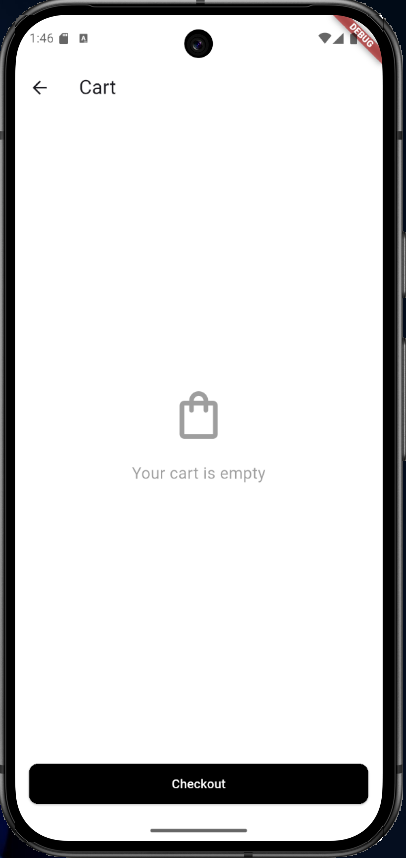

# 🛍️ My Shop App

## 📱 Proje Açıklaması

Bu proje, Flutter kullanılarak geliştirilmiş basit bir e-ticaret uygulamasıdır.
Kullanıcılar ürünleri görüntüleyebilir, detaylarını inceleyebilir ve sepete ekleyebilir.

---

## 🚀 Kullanılan Teknolojiler

* Flutter
* Dart
* REST API (FakeStore API)

---

## ⚙️ Flutter Versiyonu

Flutter 3.41.6 
Dart 3.11.4

---

## ▶️ Çalıştırma Adımları

1. Repoyu klonlayın:
```
   git clone <repo-url>
```

2. Bağımlılıkları yükleyin:
```
   flutter pub get
```

3. Uygulamayı çalıştırın:
```
   flutter run
```

---

## 📸 Ekran Görüntüleri

### 🏠 Home Screen



### 📄 Product Detail



### 🛒 Cart Screen




---
